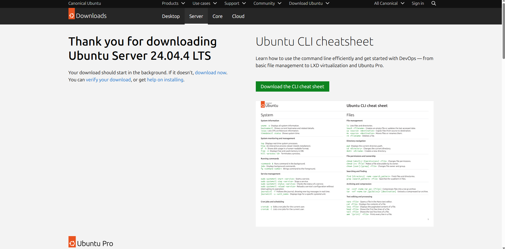

# Laporan Praktikum Sistem Operasi Jobsheet 1

<h4>Nama : Moch Dedy Triagwi<h4>
<h4>NIM  : 254107020233<h4>
<h4>Kelas: TI-1H<h4>

## Latihan 1.10

### Latihan 1.10.1 - Latihan Konseptual

#### Latihan 1.1
Jelaskan 5 fungsi utama sistem operasi dengan contoh konkret dari minimal 2
OS berbeda (Windows, macOS, atau Linux).
#### Jawaban
Fungsi:
* Sistem operasi mengatur proses yang berjalan agar CPU digunakan secara efisien
* Membuat dan mengakhiri proses
* Mengatur komunikasi antar proses (IPC)
* Menangani multitasking
* Menentukan proses mana yang mendapatkan giliran CPU

Contoh:
* Windows -> Task Manager menampilkan daftar aplikasi dan penggunaan CPU.
* Linux -> Perintah "ps, top, dan htop" untuk melihat proses aktif

#### Latihan 1.2
Kapan sebaiknya menggunakan Windows vs Linux vs macOS? Analisis
berdasarkan use case: gaming, development, server, creative work, dan enterprise.
#### Jawaban
Berdasarkan fungsi
* Windows -> Perkantoran dan Bisnis, Gaming, Aplikasi Umum & Kompatibilitas Tinggi.
* Linux -> Server dan Cloud Computing, Development dan Programming, Sistem yang Membutuhkan Stabilitas Tinggi.
* MacOS -> Creative Work (Desain, Editing, Audio, Video), Ekosistem Apple, development iOS

### Latihan 1.10.2 Latihan Praktikal

#### Latihan 1.3
Install Ubuntu Server 22.04 LTS di VirtualBox dengan langkah berikut:
1. Download Ubuntu Server ISO dari website resmi
2. Create VM baru di VirtualBox (RAM: 2GB, Disk: 25GB)
3. Install dengan automatic partitioning (guided)
4. Buat user account dengan password yang kuat
5. Reboot dan login ke sistem
6. Dokumentasikan proses instalasi dengan screenshot key steps
#### Jawaban

#### Latihan 1.4
Setelah instalasi Ubuntu Server, lakukan tasks berikut:
1. Update package list: sudo apt update
2. Upgrade packages: sudo apt upgrade
3. Install neofetch: sudo apt install neofetch
4. Jalankan neofetch dan screenshot hasilnya
5. Check disk usage dengan df -h
6. Check memory dengan free -h
7. Dokumentasikan output dari setiap command
