# Laporan Praktikum Sistem Operasi Jobsheet 2

<h4>Nama : Moch Dedy Triagwi<h4>
<h4>NIM  : 254107020233<h4>
<h4>Kelas: TI-1H<h4>

## Praktikum 2.1 - Identifikasi CPU dan Memori

1. Tampilkan informasi CPU: lscpu
   
2. Tampilkan ringkasan memori: free -h

   

3. (Opsional) cek informasi hardware dari DMI/BIOS (butuh sudo): sudo dmidecode -t system
   

#### Latihan 2.1

1. Catat: (1) jumlah CPU(s), core/thread, (2) total RAM, (3) total swap. Jelaskan perbedaan RAM vs swap dalam 2–3 kalimat.

#### Jawaban

1. Informasi CPU:
   - Jumlah CPU (vCPU): 2
   - Jumlah core: 2
   - Jumlah thread: 2 (karena 1 thread per core × 2 core)

2. Informasi Memori:
   - RAM total: 1.9 GB
   - Swap total: 2.0 GB

3. Informasi Sistem:
   - Manufacturer: innotek GmbH
   - Product Name: VirtualBox
   - Family: Virtual Machine

4. Perbedaan RAM vs swap:
   - RAM merupakan memori utama yang berfungsi untuk menjalankan program secara langsung. Akses ke RAM sangat cepat karena terhubung langsung dengan CPU. Swap adalah area di dalam disk yang dimanfaatkan sebagai memori tambahan saat RAM sudah penuh. Karena berada di dalam disk (HDD/SSD), swap jauh lebih lambat dibandingkan dengan RAM. Jika sistem terlalu sering mengandalkan swap, kinerja akan menurun.

## Praktikum 2.2 - Identifikasi Perangkat PCI/USB dan Driver

1. Lihat daftar perangkat PCI: lspci
   
2. Lihat perangkat PCI beserta driver kernel yang digunakan: lspci - nnk
   
3. Fokus pada NIC (Ethernet) untuk mencari modul driver: lspci - nnk | grep - A3 -i ethernet
   
4. Lihat perangkat USB: lsusb
   
5. Lihat topologi USB (tree): lsusb -t
   

#### Latihan 2.2

1. Temukan 1 perangkat PCI (misal NIC) dan tuliskan: Vendor:Device ID (angka
   heksadesimal), nama driver/modul kernel, dan deskripsi singkat fungsinya.

#### Jawaban

- Controller Intel 82540EM Gigabit Ethernet dengan Vendor ID 8086:100e adalah perangkat PCI yang dipilih. Driver kernel yang digunakan adalah e1000. Ini adalah kartu jaringan (NIC) yang memungkinkan sistem terhubung ke jaringan Ethernet dan berkomunikasi data melalui LAN atau internet.

## Praktikum 2.3 - Identifikasi Storage dan Filesystem

1. Lihat daftar disk/partisi: lsblk -f

   

2. Tampilkan UUID dan tipe filesystem: sudo blkid

   

3. Lihat mount point untuk root filesystem: findmnt /

   

## Praktikum 2.4 - Melihat Modul Aktif dan Informasinya

1. Cek versi kernel: uname -r

   

2. Tampilkan daftar modul aktif: lsmod | head

   

3. Pilih salah satu modul (contoh aman: loop) dan lihat detailnya: modinfo loop

   

4. Muat modul (jika belum aktif), lalu verifikasi: sudo modprobe loop, lsmod | grep -i loop

   

5. (Opsional) lihat pesan kernel terbaru: dmesg -T | tail -n 20

   

## Praktikum 2.5 - Konfigurasi Auto-load dan Blacklist

1. Buat file auto-load: echo " loop " | sudo tee / etc / modules - load . d / loop . conf

   

2. Simulasikan verifikasi (tanpa reboot) dengan memastikan modul sudah aktif: lsmod | grep -i loop

   

3. (Opsional, konsep) blacklist modul: # echo "blacklist loop" | sudo tee /etc/modprobe.d/ blacklist - loop . conf

   

## Praktikum 2.6 - Mengenali Block vs Character Device

1. Lihat detail salah satu disk (sesuaikan dengan perangkat Anda, misal sda): ls -l / dev / sda

   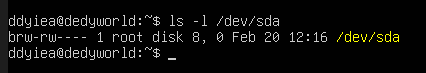

2. Lihat detail device terminal: ls -l / dev / tty

   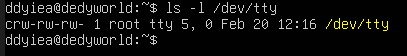

3. Lihat disk dan partisi untuk mengaitkan dengan /dev: lsblk

   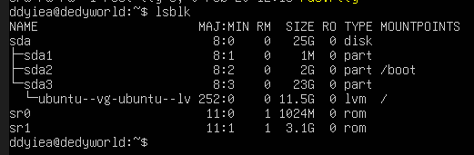

#### Latihan 2.3

1. Dari output ls -l, jelaskan perbedaan penanda file untuk block device dan
   character device. (Hint: karakter pertama pada permission string)

#### Jawaban

Perbedaan block device dan character device dilihat dari huruf pertama permission:

- b -> Block device (contoh: /dev/sda)
- c -> Character device (contoh: /dev/tty)

Block device digunakan untuk penyimpanan berbasis blok (disk).
Character device digunakan untuk perangkat berbasis aliran karakter seperti terminal.

## Praktikum 2.7 - Melihat Informasi udev

1. Cek atribut udev untuk disk: udevadm info -- query = all -- name =/ dev / sda | head -n 30

   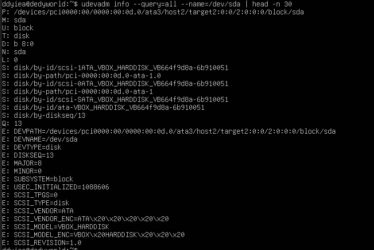

2. (Opsional) monitor event udev (jalankan, lalu colok/lepas USB pada mesin
   fisik):
   sudo udevadm monitor

   

## Praktikum 2.8 - Membuat Workspace Praktikum

1. Buat direktori praktikum dan masuk ke dalamnya:

   ```
   1. mkdir -p ~/ praktikum - os / week02
   2. cd ~/ praktikum - os / week02
   3. pwd
   ```

   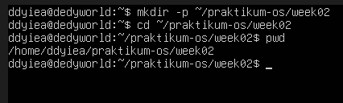

2. Buat beberapa file contoh:

   ```
   1. touch notes . txt data . log config . txt
   2. ls - lah
   ```

   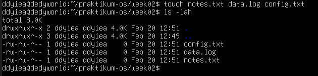

3. Isi file log contoh (simulasi):

   ```
   1. echo " INFO : service started " >> data . log
   2. echo " WARN : disk usage high " >> data . log
   3. echo " ERROR : failed to connect " >> data . log
   4. cat data . log
   ```

   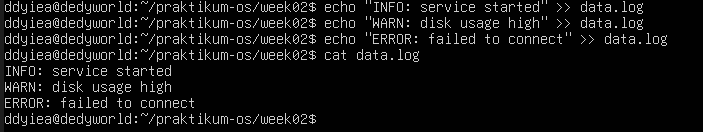

4. Baca file dengan less:
   ```
   less data . log
   ```
   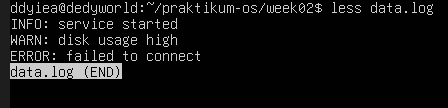

## Praktikum 2.9 - Pencarian Pola dengan grep

1. Cari baris yang mengandung ERROR pada data.log:

   ```
   grep " ERROR " data . log
   ```
   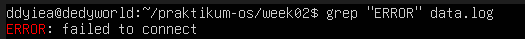
2. Cari tanpa memperhatikan huruf besar/kecil:

   ```
   grep -i " error " data . log
   ```
   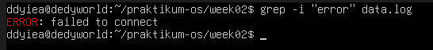

3. Tampilkan nomor baris:

   ```
   grep -n " WARN " data . log
   ```
   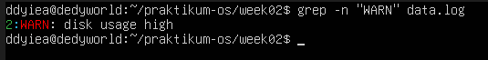
4. Tampilkan baris yang tidak cocok (invert match):

   ```
   grep -v " INFO " data . log
   ```
   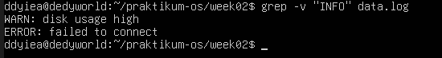

#### Latihan 2.4

1. Gunakan grep untuk menampilkan hanya baris yang mengandung INFO atau
WARN dari data.log. (Hint: gunakan grep -E dengan pola alternatif)

#### Jawaban
   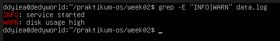

## Praktikum 2.10 - Substitusi dengan sed (Aman di File Latihan)

1. Siapkan file konfigurasi latihan:
   ```
   1. cat > config.txt << ’EOF’
   2. PORT =8080
   3. MODE = dev
   4. SERVICE_NAME = myserver
   5. EOF
   6. cat config.txt
   ```
   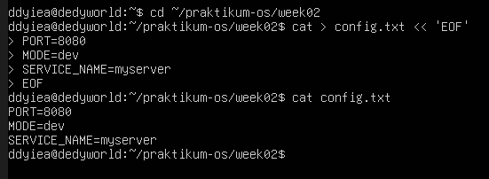

2. Ganti dev menjadi prod (tanpa mengubah file asli):
   ```
   sed ’s/ MODE =dev/ MODE = prod /’ config . txt
   ```
   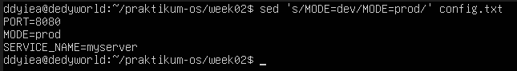

3. Terapkan perubahan langsung ke file (-i):
   ```
   1.  sed -i ’s/ MODE =dev/ MODE = prod /’ config . txt
   2. cat config . txt
   ```
   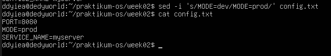

4. Ganti semua kemunculan kata (g untuk global), contoh ubah myserver menjadi node:
   ```
   1. sed -i ’s/ myserver / node /g’ config . txt
   2. cat config . txt
   ```
   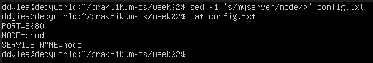

## Praktikum 2.11 - Ekstraksi Kolom dengan awk

1. Lihat output df -h:
   ```
   df -h
   ```
   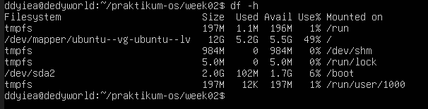

2. Ambil kolom filesystem dan persentase pemakaian:
   ```
    df -h | awk ’NR==1 {print $1, $5, $6} NR>1 {print $1, $5, $6}’
   ```
   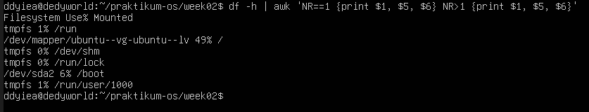

3. Filter hanya yang pemakaian disk di atas 80%:
   ```
   df -h | awk ’NR==1 || ($5 +0) > 80 {print $1 , $5 , $6}’
   ```
   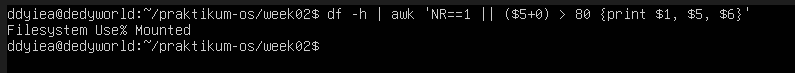

## Praktikum 2.12 - Melihat Proses dengan ps

1. Tampilkan semua proses (format BSD):
   ```
   ps aux | head
   ```
   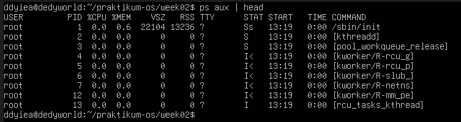

2. Cari proses tertentu (misal sshd):
   ```
   ps aux | grep -i sshd
   ```
   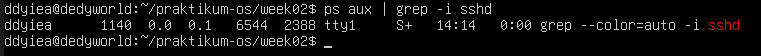

## Praktikum 2.13 - Monitoring Real-time dengan top

1. Jalankan top:
   ```
   top
   ```
   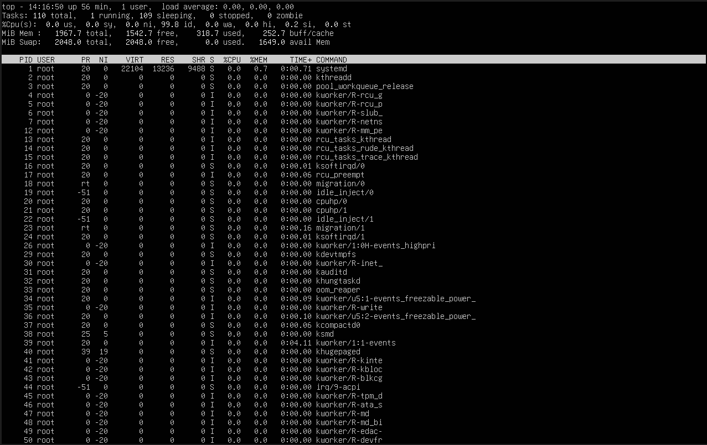

2. Amati nilai load average, pemakaian CPU, dan proses teratas. Tekan q untuk
keluar.

## Praktikum 2.14 -  Menghentikan Proses dengan kill

1. Jalankan proses dummy di background:
   ```
   sleep 300 &
   ```
   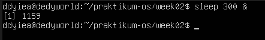

2. Cari PID proses sleep:
   ```
   ps aux | grep -E "sleep 300" | grep -v grep
   ```
   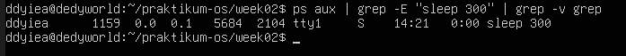

3. Hentikan dengan SIGTERM:
   ```
   kill <PID_ANDA>
   ```
   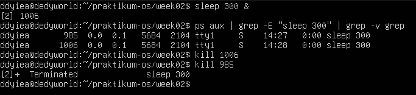

4. Verifikasi proses berhenti:
   ```
   ps aux | grep -E " sleep 300 " | grep -v grep
   ```
   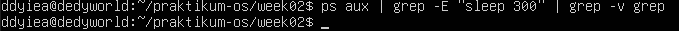

5. (Opsional) Jika proses sulit untuk dihentikan dan Anda membutukan untuk menghentikan proses tersebut, gunakan SIGKILL:
   ```
   kill -9 < PID_ANDA>
   ```

## Praktikum 2.15 - Cek Disk, Load, dan Service

1.  Cek penggunaan disk:
   ```
   df -h
   ```
   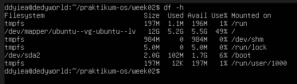

2. Cari direktori yang besar (contoh pada /var):
   ```
   sudo du - sh / var /* 2 >/ dev / null | sort -h | tail -n 10
   ```
   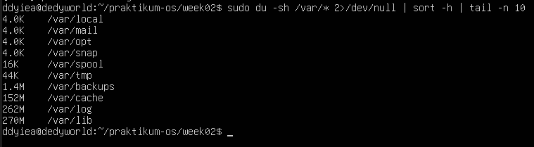

3. Cek load dan uptime:
   ```
   uptime
   ```
   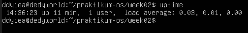

4. Cek service yang gagal:
   ```
   systemctl -- failed
   ```
   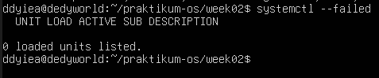

5. Ambil log error terbaru (jika ada indikasi masalah):
   ```
   journalctl - xe | tail -n 50
   ```
   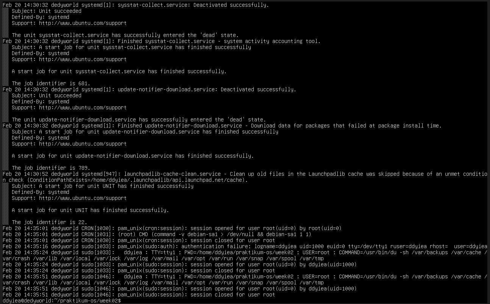

## Praktikum 2.16 - Monitoring Port dan Koneksi (Network Basics)

1. Lihat interface dan IP:
   ```
   ip a
   ```
   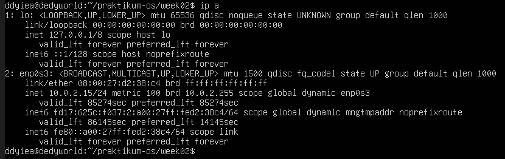

2. Lihat routing table:
   ```
   ip r
   ```
   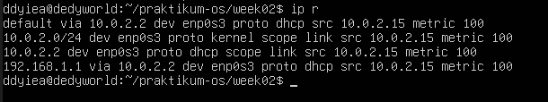

3. Lihat port yang sedang listening:
   ```
   sudo ss - tulpn
   ```
   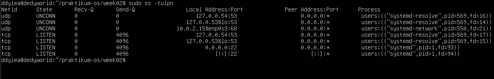

#### Latihan 2.5

1. Pilih satu port yang listening dari output ss -tulpn(misal port 22), lalu
tuliskan service/proses yang membukanya. Jelaskan kegunaan port tersebut
secara singkat.

#### Jawaban

- port 22 (TCP).
Layanan SSH, juga dikenal sebagai Secure Shell, menggunakan port 22 untuk memungkinkan Anda mengakses atau log in ke server dari jarak jauh dengan aman melalui jaringan. Status LISTEN menunjukkan bahwa server siap menerima koneksi SSH dari perangkat lain.

## Latihan 1.9

### Latihan 2.A
1. Jalankan lspci -nnk. Pilih 1 perangkat PCI dan tuliskan: nama perangkat, ID vendor:device, dan kernel driver in use.

### Jawaban 2.A

### Latihan 2.B
1. Tentukan device root filesystem dengan findmnt /. Lalu cocokkan dengan lsblk -f dan tuliskan tipe filesystem serta UUID-nya.

### Jawaban 2.B

### Latihan 2.C
