# Laporan Praktikum Sistem Operasi Jobsheet 2

<h4>Nama : Moch Dedy Triagwi<h4>
<h4>NIM  : 254107020233<h4>
<h4>Kelas: TI-1H<h4>

## Praktikum 2.1 - Identifikasi CPU dan Memori

1. Tampilkan informasi CPU: lscpu
   
2. Tampilkan ringkasan memori: free -h

   

3. (Opsional) cek informasi hardware dari DMI/BIOS (butuh sudo): sudo dmidecode -t system
   

#### Latihan 2.1

1. Catat: (1) jumlah CPU(s), core/thread, (2) total RAM, (3) total swap. Jelaskan perbedaan RAM vs swap dalam 2–3 kalimat.

#### Jawaban

1. Informasi CPU:
   - Jumlah CPU (vCPU): 2
   - Jumlah core: 2
   - Jumlah thread: 2 (karena 1 thread per core × 2 core)

2. Informasi Memori:
   - RAM total: 1.9 GB
   - Swap total: 2.0 GB

3. Informasi Sistem:
   - Manufacturer: innotek GmbH
   - Product Name: VirtualBox
   - Family: Virtual Machine

4. Perbedaan RAM vs swap:
   - RAM merupakan memori utama yang berfungsi untuk menjalankan program secara langsung. Akses ke RAM sangat cepat karena terhubung langsung dengan CPU. Swap adalah area di dalam disk yang dimanfaatkan sebagai memori tambahan saat RAM sudah penuh. Karena berada di dalam disk (HDD/SSD), swap jauh lebih lambat dibandingkan dengan RAM. Jika sistem terlalu sering mengandalkan swap, kinerja akan menurun.

## Praktikum 2.2 - Identifikasi Perangkat PCI/USB dan Driver

1. Lihat daftar perangkat PCI: lspci
   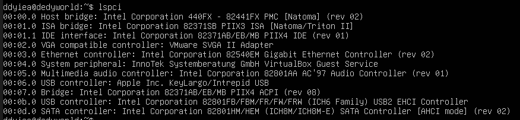
2. Lihat perangkat PCI beserta driver kernel yang digunakan: lspci - nnk
   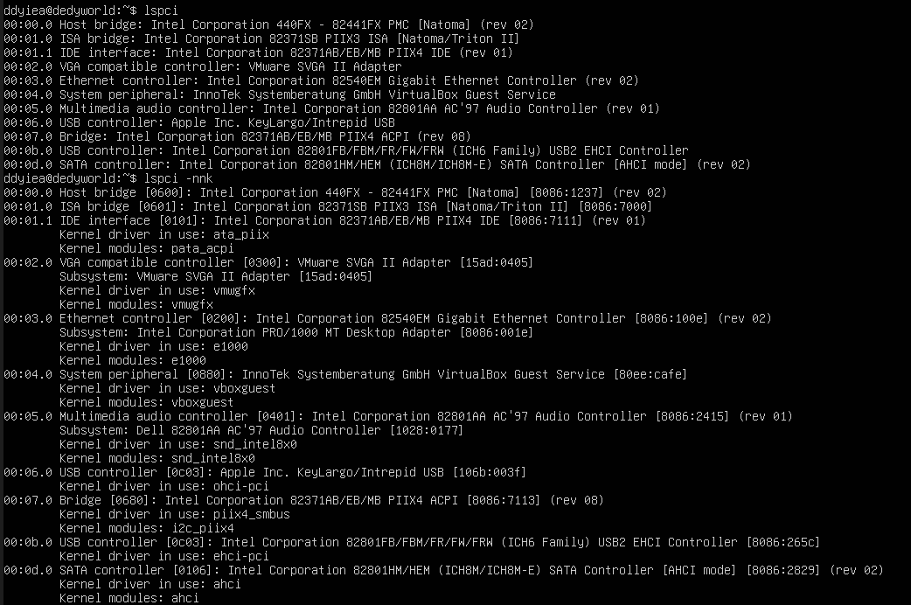
3. Fokus pada NIC (Ethernet) untuk mencari modul driver: lspci - nnk | grep - A3 -i ethernet
   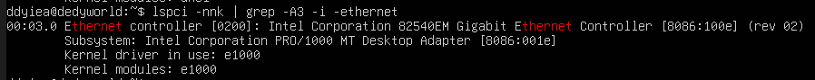
4. Lihat perangkat USB: lsusb
   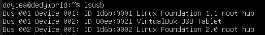
5. Lihat topologi USB (tree): lsusb -t
   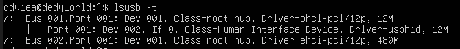

#### Latihan 2.2

1. Temukan 1 perangkat PCI (misal NIC) dan tuliskan: Vendor:Device ID (angka
   heksadesimal), nama driver/modul kernel, dan deskripsi singkat fungsinya.

#### Jawaban

- Controller Intel 82540EM Gigabit Ethernet dengan Vendor ID 8086:100e adalah perangkat PCI yang dipilih. Driver kernel yang digunakan adalah e1000. Ini adalah kartu jaringan (NIC) yang memungkinkan sistem terhubung ke jaringan Ethernet dan berkomunikasi data melalui LAN atau internet.

## Praktikum 2.3 - Identifikasi Storage dan Filesystem

1. Lihat daftar disk/partisi: lsblk -f

   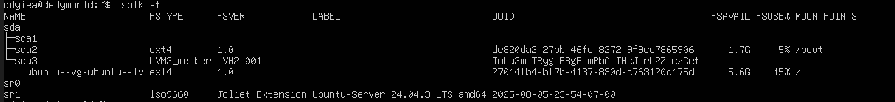

2. Tampilkan UUID dan tipe filesystem: sudo blkid

   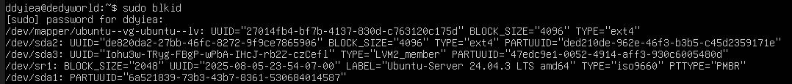

3. Lihat mount point untuk root filesystem: findmnt /

   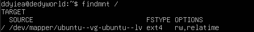

## Praktikum 2.4 - Melihat Modul Aktif dan Informasinya

1. Cek versi kernel: uname -r

   

2. Tampilkan daftar modul aktif: lsmod | head

   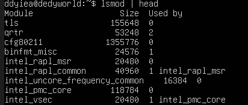

3. Pilih salah satu modul (contoh aman: loop) dan lihat detailnya: modinfo loop

   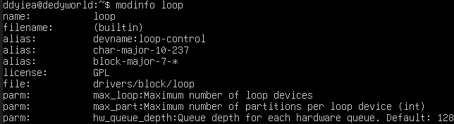

4. Muat modul (jika belum aktif), lalu verifikasi: sudo modprobe loop, lsmod | grep -i loop

   

5. (Opsional) lihat pesan kernel terbaru: dmesg -T | tail -n 20

   

## Praktikum 2.5 - Konfigurasi Auto-load dan Blacklist

1. Buat file auto-load: echo " loop " | sudo tee / etc / modules - load . d / loop . conf

   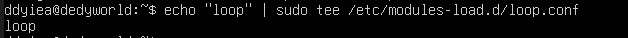

2. Simulasikan verifikasi (tanpa reboot) dengan memastikan modul sudah aktif: lsmod | grep -i loop

   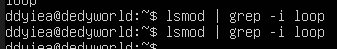

3. (Opsional, konsep) blacklist modul: # echo "blacklist loop" | sudo tee /etc/modprobe.d/ blacklist - loop . conf

   

## Praktikum 2.6 - Mengenali Block vs Character Device
