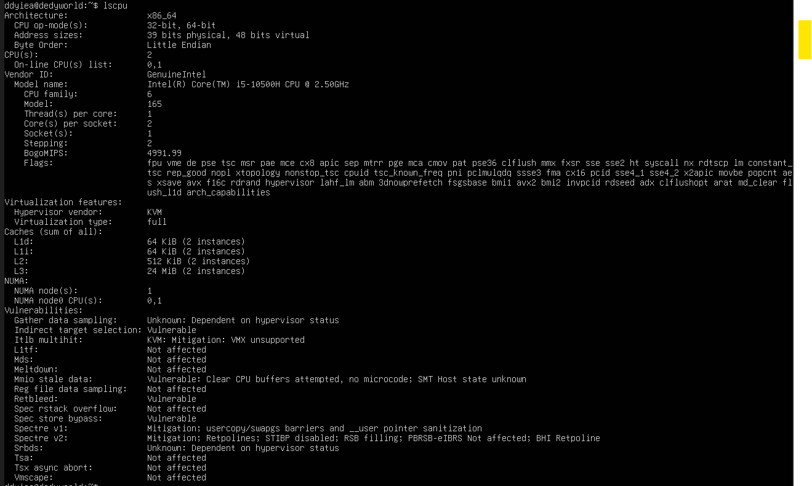
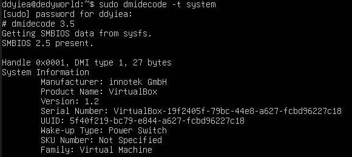

# Laporan Praktikum Sistem Operasi Jobsheet 2

<h4>Nama : Moch Dedy Triagwi<h4>
<h4>NIM  : 254107020233<h4>
<h4>Kelas: TI-1H<h4>

## Praktikum 2.1 - Identifikasi CPU dan Memori

1. Tampilkan informasi CPU: lscpu
   
2. Tampilkan ringkasan memori: free -h
   
3. (Opsional) cek informasi hardware dari DMI/BIOS (butuh sudo): sudo dmidecode -t system
   

#### Latihan 2.1

1. Catat: (1) jumlah CPU(s), core/thread, (2) total RAM, (3) total swap. Jelaskan perbedaan RAM vs swap dalam 2–3 kalimat.

#### Jawaban

1. Informasi CPU:
   - Jumlah CPU (vCPU): 2
   - Jumlah core: 2
   - Jumlah thread: 2 (karena 1 thread per core × 2 core)

2. Informasi Memori:
   - RAM total: 1.9 GB
   - Swap total: 2.0 GB

3. Informasi Sistem:
   - Manufacturer: innotek GmbH
   - Product Name: VirtualBox
   - Family: Virtual Machine

4. Perbedaan RAM vs swap:
   - RAM merupakan memori utama yang berfungsi untuk menjalankan program secara langsung. Akses ke RAM sangat cepat karena terhubung langsung dengan CPU. Swap adalah area di dalam disk yang dimanfaatkan sebagai memori tambahan saat RAM sudah penuh. Karena berada di dalam disk (HDD/SSD), swap jauh lebih lambat dibandingkan dengan RAM. Jika sistem terlalu sering mengandalkan swap, kinerja akan menurun.
