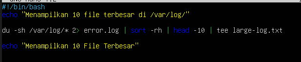
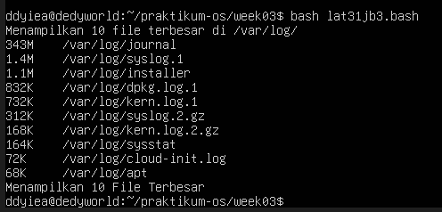
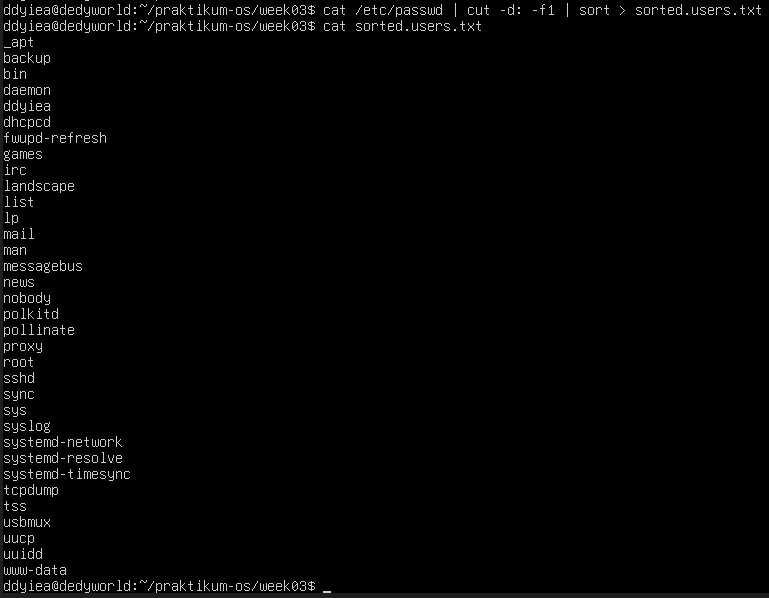
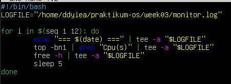
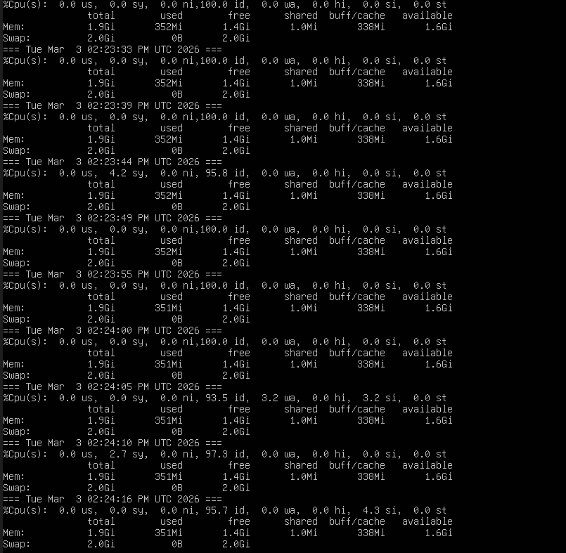
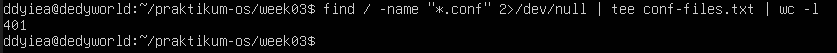
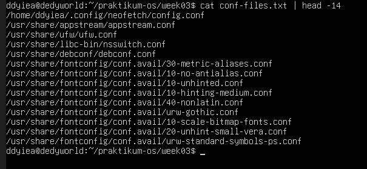
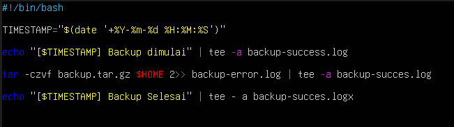
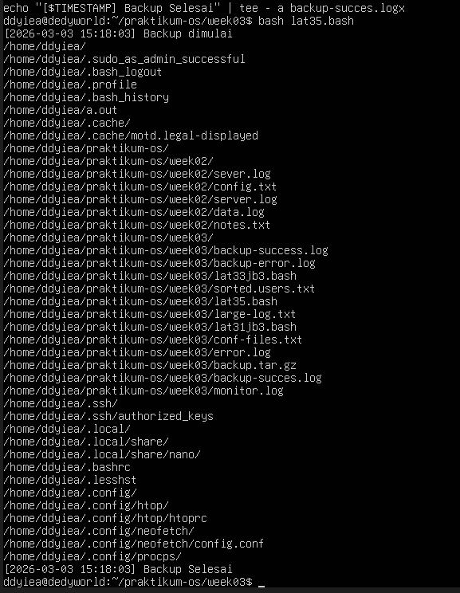

# Laporan Praktikum Sistem Operasi Jobsheet 3

<h4>Nama : Moch Dedy Triagwi<h4>
<h4>NIM  : 254107020233<h4>
<h4>Kelas: TI-1H<h4>

## 1.1 Latihan

### Pertanyaan Latihan 3.1

Buatlah script yang:

1. Menampilkan daftar 10 file terbesar di direktori /var/log/
2. Menyimpan hasilnya ke file large-logs.txt
3. Menampilkan output juga di terminal menggunakan tee
4. Menangani error dengan redirect ke error.log

### Jawaban

```
#!/bin/bash
echo "Menampilkan 10 file terbesar di /var/log/"

du -sh /var/log* 2> error.log | sort -rh | head -10 | tee large-log.txt

echo "Menampilkan 10 File Terbesar"
```

- Hasil Terminal
  
  

### Pertanyaan Latihan 3.2

Buat pipeline yang:

1. Membaca /etc/passwd
2. Mengekstrak username (kolom pertama)
3. Mengurutkan alfabetis
4. Menyimpan ke file sorted-users.txt

Hint: Gunakan cut, sort, dan operator redirect.

### Jawaban

```
cat /etc/passwd | cut -d1 -f1 | sort > sorted.users.txt
```

- Hasil Terminal
  

### Pertanyaan 3.3

Tulis script monitoring yang:

1. Mencatat penggunaan CPU dan memory setiap 5 detik
2. Menyimpan log dengan timestamp
3. Berjalan selama 1 menit (12 iterasi)
4. Output ditampilkan di terminal DAN disimpan ke file

### Jawaban

```
#!/bin/bash
LOGFILE="/home/ddyiea/praktikum-os/week03/monitor.log"

for i in $(seq 1 12); do
    echo "=== $(date) ===" | tee -a "$LOGFILE"
    top -bn1 | grep "Cpu(s)" | tee -a "$LOGFILE"
    free -h | tee -a "$LOGFILE"
    sleep 5
done
```

- Hasil Terminal

  
  

### Pertanyaan 3.4

Buat perintah yang:

1. Mencari semua file .conf di sistem
2. Membuang pesan "Permission denied"
3. Menghitung jumlah file yang ditemukan
4. Menyimpan daftar path lengkap ke file

### Jawaban

```
find / -name "*.conf" 2>/dev/null | tee conf-files.txt | wc -l
```

- Hasil Terminal

  
  

### Pertanyaan 3.5

Implementasikan script backup yang:

1. Menggunakan tar untuk backup direktori
2. Menampilkan progress dengan tee
3. Mencatat stdout ke backup-success.log
4. Mencatat stderr ke backup-error.log
5. Menambahkan timestamp di setiap log entry

### Jawaban

```
#!/bin/bash

TIMESTAMP="$(date '+%Y-%m-%d %H:%M:%S')"

echo "[$TIMESTAMP] Backup dimulai" | tee -a backup-success.log

tar -czvf backup.tar.gz $HOME 2>> backup-error.log | tee -a backup-success.log

echo "[$TIMESTAMP] Backup selesai" | tee -a backup-success.log
```

- Hasil Terminal

    
    