# Laporan Praktikum Sistem Operasi Jobsheet 4

<h4>Nama : Moch Dedy Triagwi<h4>
<h4>NIM  : 254107020233<h4>
<h4>Kelas: TI-1H<h4>

## Percobaan 1: Direktory

Langkah-langkah:

1. Melihat direktori HOME

```
pwd
echo $HOME
```

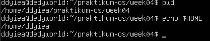

2. Melihat direktori aktual dan parent

```
pwd
cd .
pwd
cd ..
pwd
cd
```

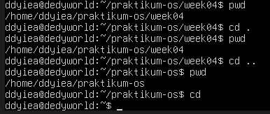

3. Membuat satu direktori, lebih dari satu direktori atau sub direktori

```
pwd
mkdir A B C A/D A/E B/F A/D/A
ls -l
ls -l A
ls -l A/D
```

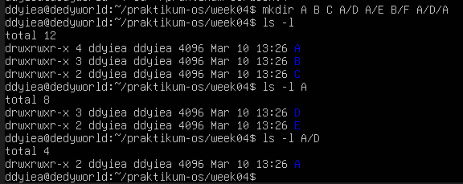

4. Menghapus satu atau lebih direktori hanya dapat dilakukan pada direktori kosong dan hanya dapat dihapus oleh pemiliknya kecuali bila diberikan ijin aksesnya

```
rmdir B
ls -l B
rmdir B/F B
ls -l B
```

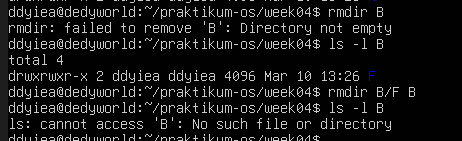

- Terjadi error saat rmdir B karena direktori B tidak kosong sehingga tidak bisa dihapus
- Terjadi error saat ls -l B karena direktori B sudah dihapus sehingga tidak bisa di-list

5. Navigasi direktori dengan instruksi cd untuk pindah dari satu direktori ke direktori lain.

```
pwd
ls -l
cd A
pwd
cd ..
pwd
cd /home/ddyiea/praktikum-os/week04/C
pwd
cd /ddyiea/praktikum-os/week04/C
pwd
```

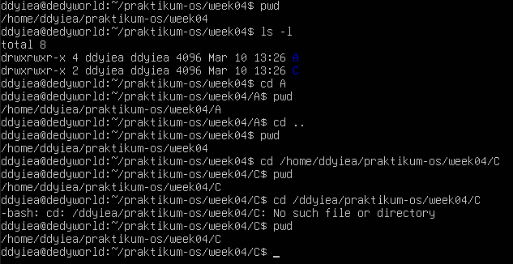

- Terjadi error karena alamat yang ditulis tidak lengkap, jika ingin menulis alamat tanpa harus menulis /home/username/ maka kita bisa menggunakan ~ sebagai pengganti dan bukannya langsung menulis /username/

## Percobaan 2: Manipulasi File

Langkah-langkah:

1. Perintah cp untuk mengkopi file atau seluruh direktori

```
cat > contoh
Membuat sebuah file
[Cntrl-d]
cp contoh contoh1
ls -l
cp contoh A
ls -l A
cp contoh contoh1 A/D
ls -l A/D
```

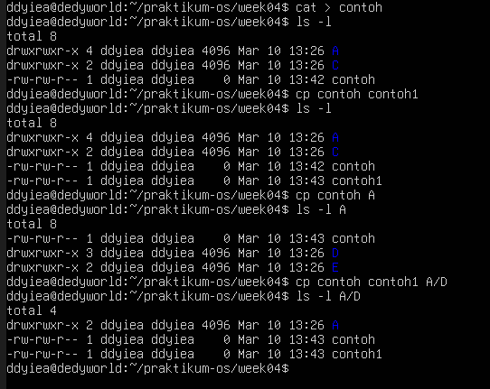 2. Perintah mv untuk memindah file

```
mv contoh contoh2
ls -l
mv contoh1 contoh2 A/D
ls -l A/D
mv contoh contoh1 C
ls -l C
```

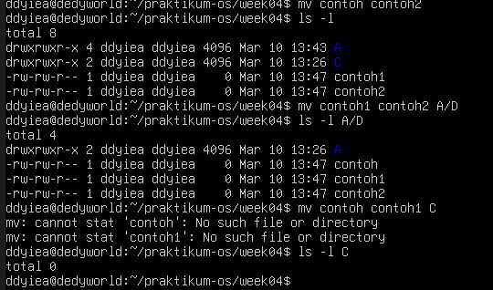

3. Perintah rm untuk menghapus file

```
rm contoh2
ls -l
rm -i contoh
rm -rf A C
ls -l
```

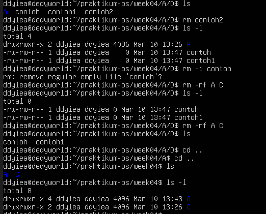

## Percobaan 3: Symbolic Link

```
echo "Hello apa khabar" > halo.txt
ls -l
ln halo.txt z
ls -l
cat z
mkdir mydir
ln z mydir/halo.juga
cat mydir/halo.juga
ln -s z bye.txt
ls -l bye.txt
cat bye.txt
```

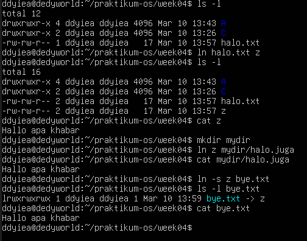

## Percobaan 4: Melihat Isi File

```
ls -l
file halo.txt
file bye.txt
```

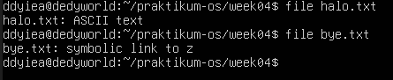

## Percobaan 5: Mencari File

1. Perintah find

```
find /home -name "*.txt" -print > myerror.txt
cat myerror.txt
find . -name "*.txt" -exec wc -l '{}' ';'
```

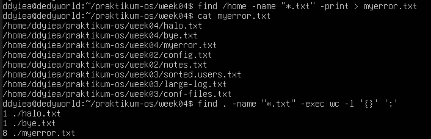 2. Perintah which

```
which ls
```

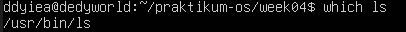

3. Perintah locate

```
locate "*.txt"
```

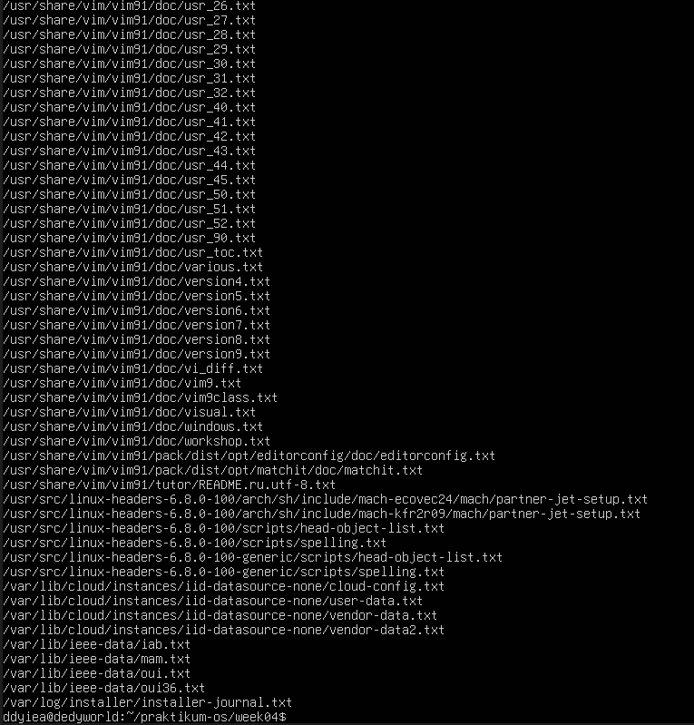

## Percobaan 6: Mencari text pada file

```
grep Hallo *.txt
```

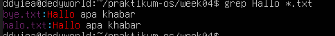

## Latihan

1. Cobalah urutan perintah berikut:

```
cd
pwd
ls -al
cd .
pwd
cd ..
pwd
ls -al
cd ..
pwd
ls -al
cd /etc
ls -al | more
cat passwd
cd -
pwd
```

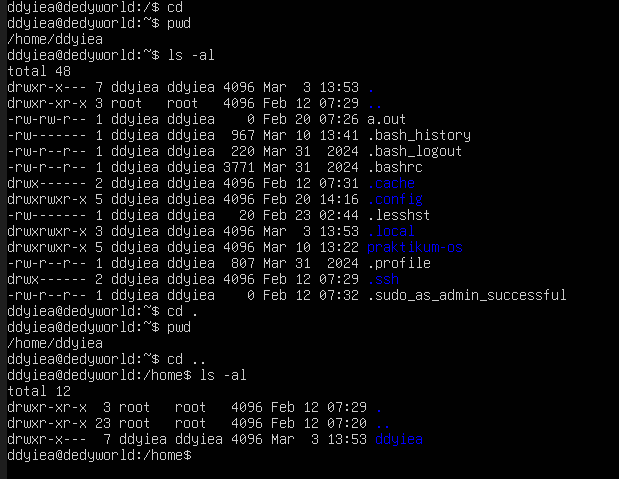
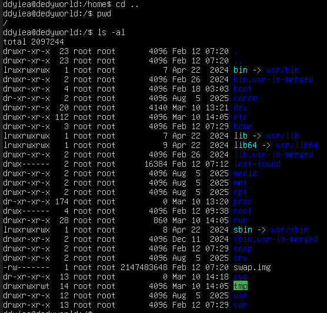
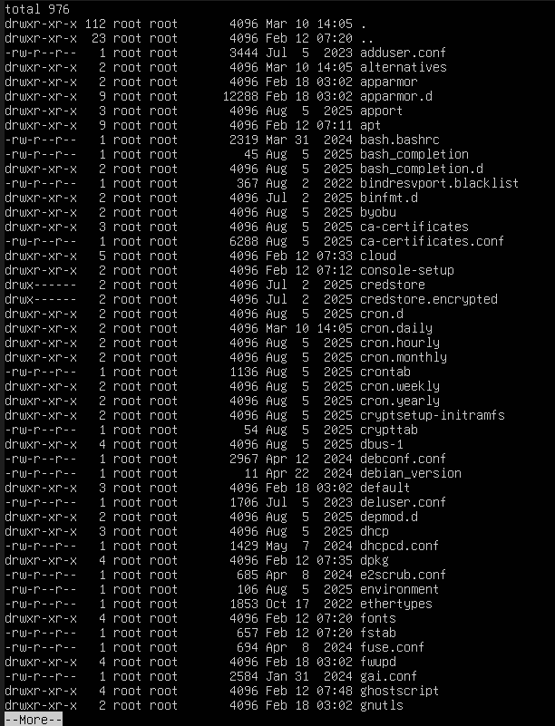
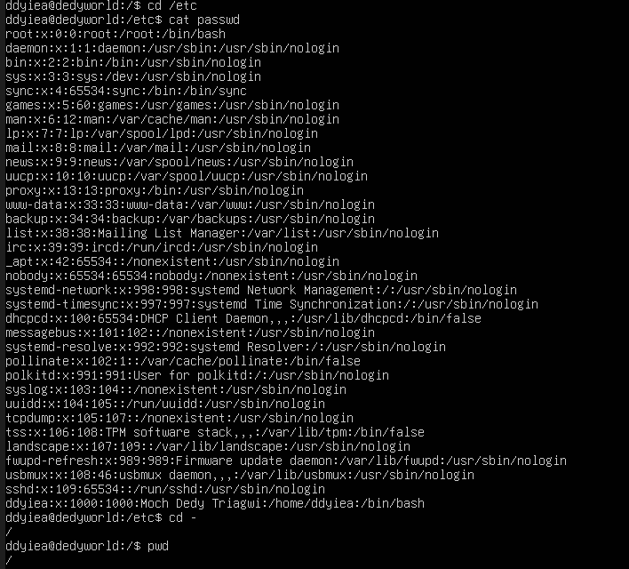

2. Lanjutkan penelusuran pohon pada sistem file menggunakan cd, ls, owd, dan cat. Telusuri direktory /bin, /usr/bin, /sbin, /tmp, dan /boot

- /bin

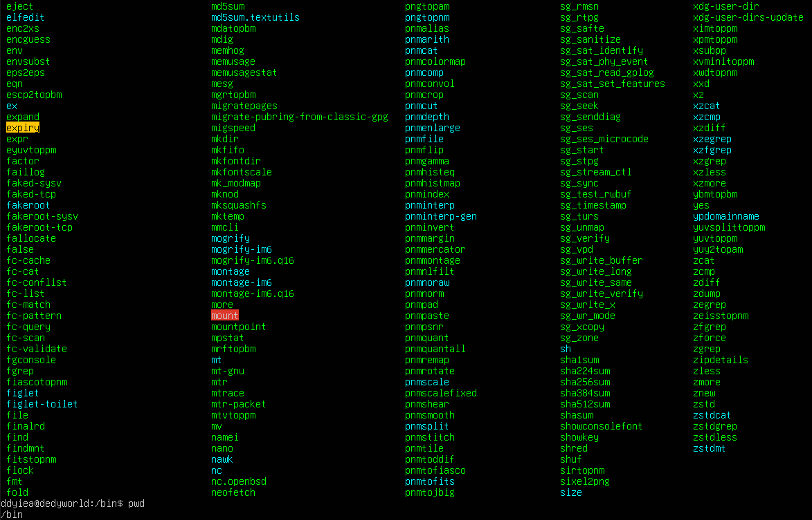

- /usr/bin

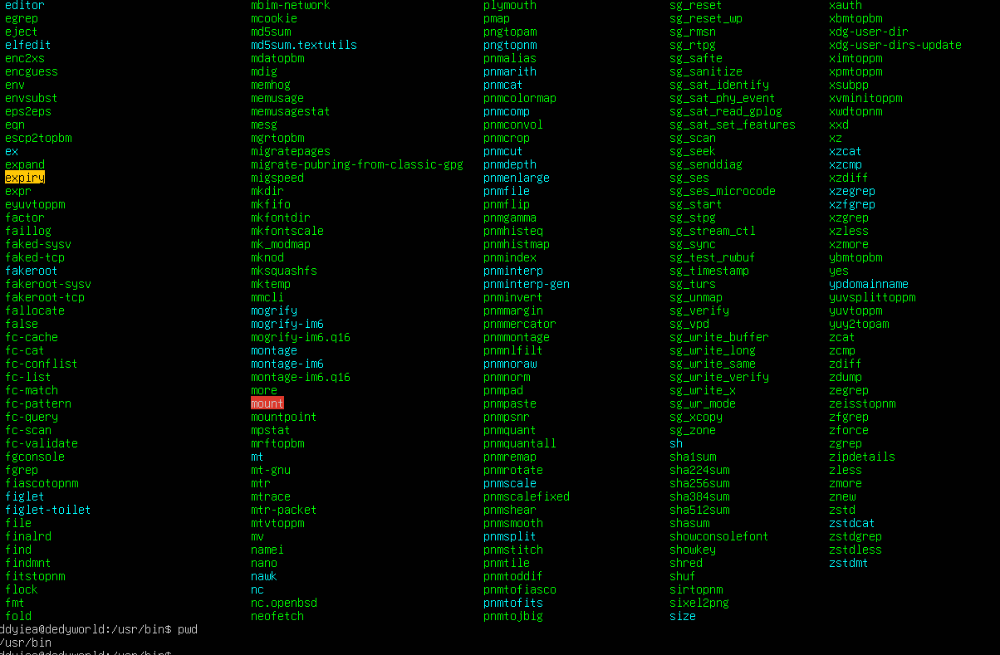

- /sbin

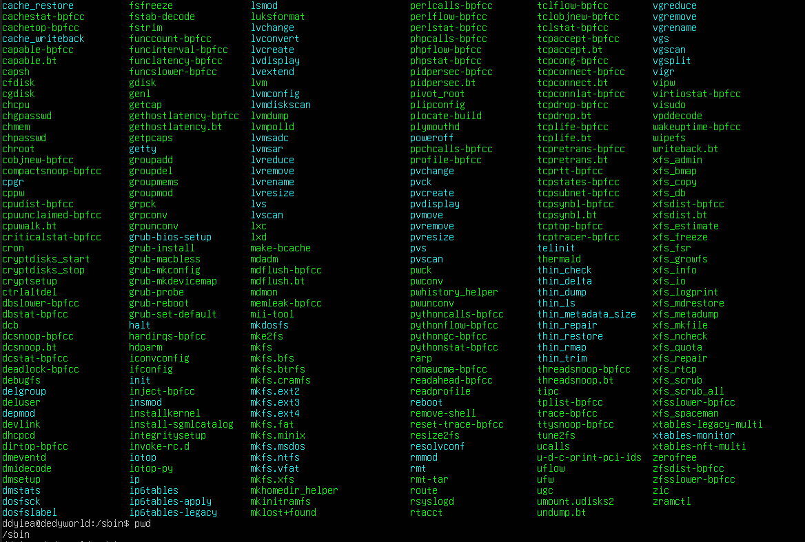

- /tmp

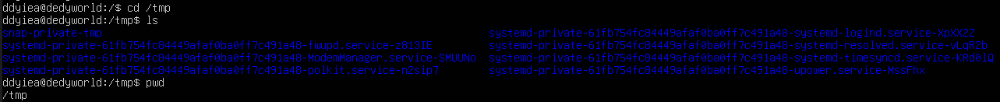

- /boot

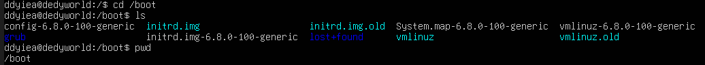

3. Telusuri direkoty /dev. Identifikasi perangkat yang tersedia. Identifikasi tty (terminal) Anda (ketik who am i); siapa pemilik tty Anda (gunakan ls -l)

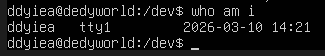
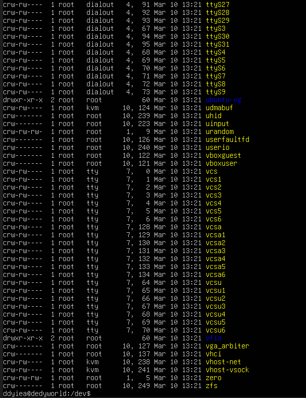

4. Telusuri directory /proc. Tampilkan isi file interrupts, devices, cpuinfo, meminfo dan uptime menggunakan perintah cat. Dapatkah anda melihat mengapa directory /proc disebut pseudo-filesystem yang memungkinkan akses ke struktu data kernel?

- interrupts

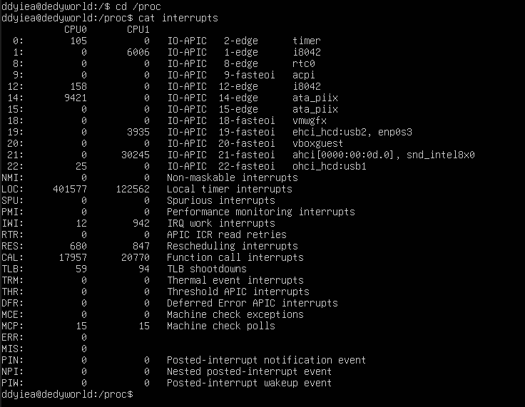

- devices

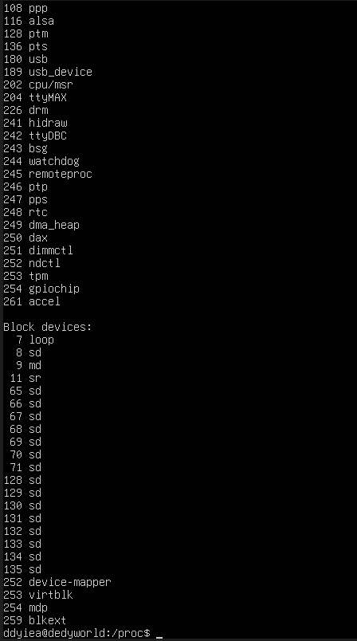

- cpuinfo

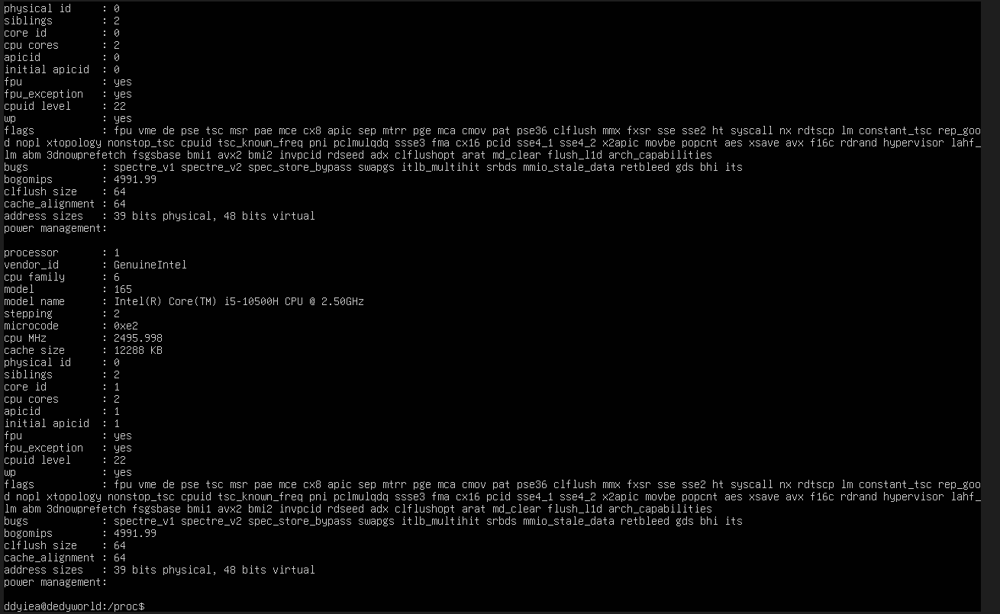

- meminfo

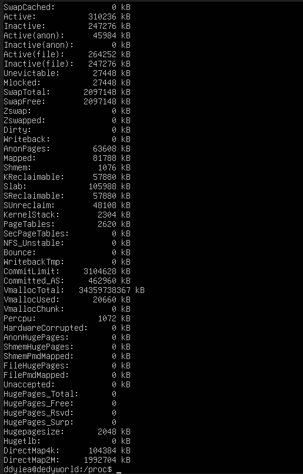

- uptime

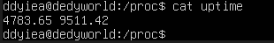

5. Ubahlah direktory home ke user lain secara langsung menggunakan cd ~username

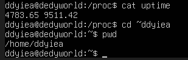

6. Ubah kembali ke directory home anda

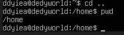

7. Buat subdirectory work dan play

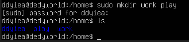

8. Hapus directory work

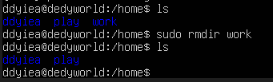

9. copy file /etc/passwd ke directory home anda

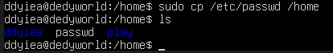

10. Pindahkan ke subdirectory play

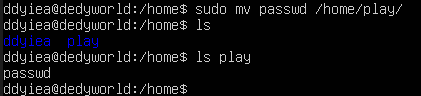

11. Ubahlah ke direktory play dan buat symbolic link dengan nama terminal yang menunjuk ke perangkat tty. Apa yang terjadi jika melakukan hard link ke perangkat tty?

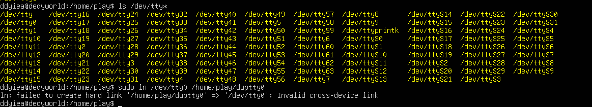

- Akan terjadi error "Invalid cross-device link" jika melakukan hard link ke perangkat tty

12. Buatlah file bernama hello.txt yang berisi kata "hello world". Dapatkah anda gunakan "cp" menggunakan "terminal" sebagai file asal untuk menghasilkan efek yang sama

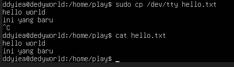

13. Copy hello.txt e terminal. Apa yang terjadi?

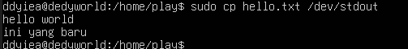

14. Masih direktory home, copy keseluruhan direktory ke direktory bernama menggunakan symbolic link.

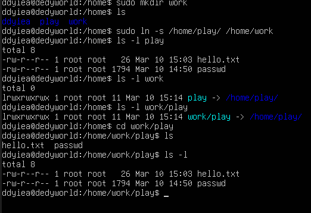

15. Hapus direktory work dan isinya dengan satu perintah

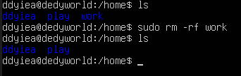