# Laporan Praktikum Sistem Operasi Jobsheet 5

<h4>Nama    : Moch Dedy Triagwi<h4>
<h4>NIM     : 254107020233<h4>
<h4>Kelas   : TI-1H<h4>

## Praktikum 6.1 - Melihat Proses dan Thread

Langkah-langkah:

1. Tampilkan semua proses yang berjalan:

```
ps aux
```

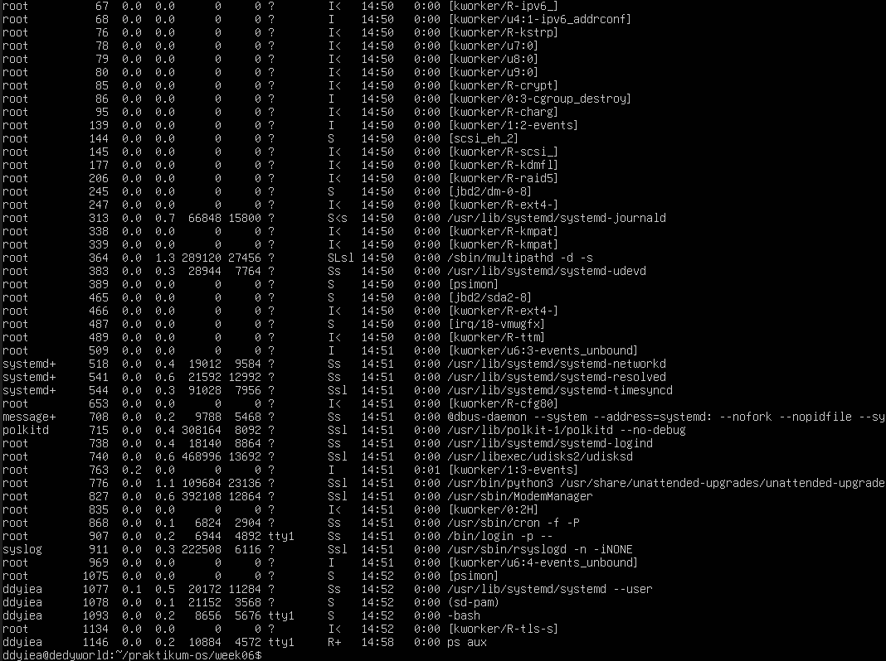

2. Tampilkan proses beserta thread-nya, dapat dilihat pada kolom LWP (Light-Weight Proccess ID):

```
ps aux -L
```

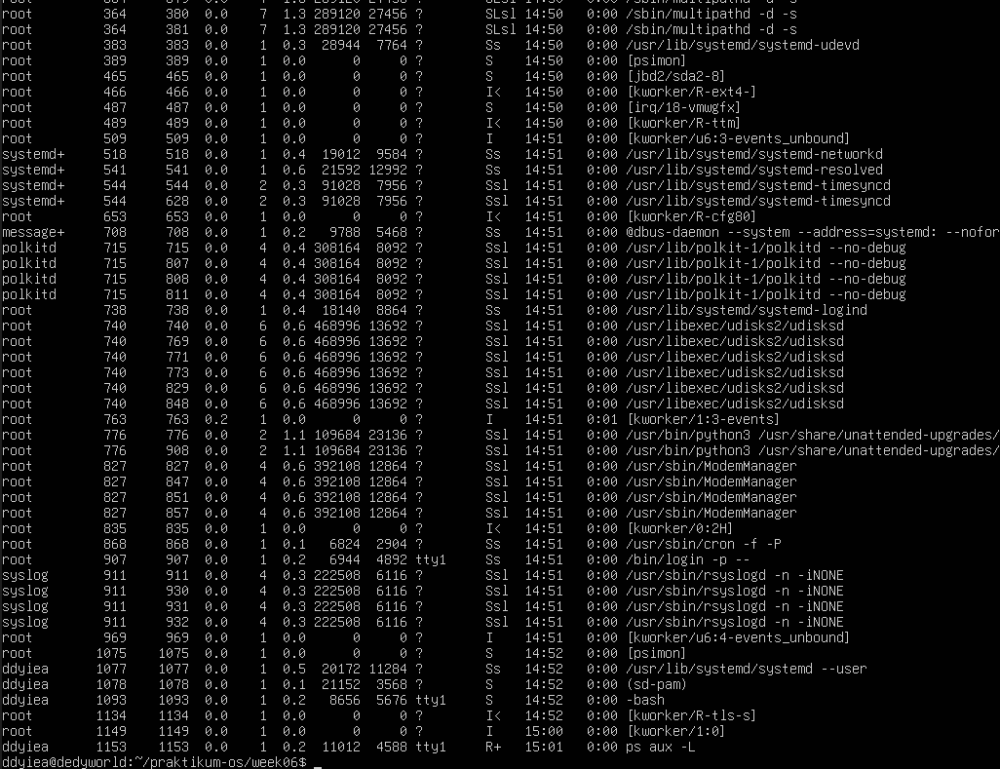

3. Lihat PID shell aktif dan detail prosesnya:

```
echo $$
ps -p $$ -f
```

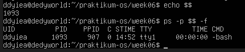

4. Lihat hierarki proses secara visual:

```
pstree -p
```

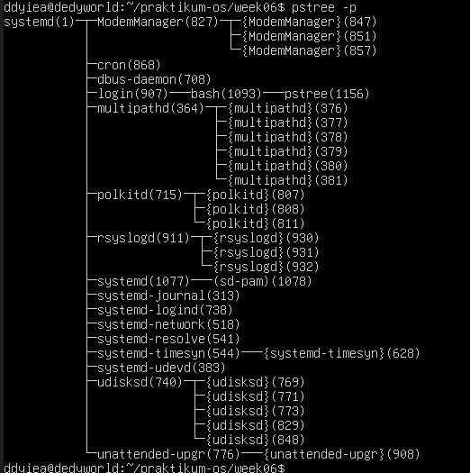

### Pertanyaan Latihan 6.1

1. Berapa total proses yang berjalan? Proses apa yang memiliki PID terkecil?
2. Jalankan pstree -p dan temukan proses bash Anda. Proses apa yang menjadi induk (PPID) dari bash tersebut?
3. Bandingkan output ps aux dan ps aux -L. Apa perbedaan yang anda lihat?

### Jawaban Latihan 6.1

1.  a. Total proses berjalan:
    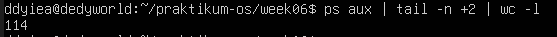
    b. PID terkecil:
    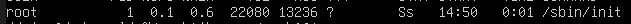

2.  PID bash saya adalah 1093
    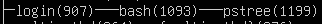

3.  ps aux:
    

    ps aux -L:
    

    Perbedaan yang terlihat adalah output dari ps aux -L menunjukkan lwp (Light Weight Process) dan ps aux tdk menunjukan itu

## Praktikum 6.2 - Mengamati Siklus Hidup Proses

Langkah-langkah:

1. Buat proses di backgorund dan amati kondisinya:

```
sleep 60 &
ps aux | grep sleep
```

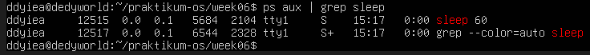

2. Amati perubahan exit code dari perintah yang berhasil dan gagal:

```
ls /tmp
echo "Sukses: $?"

ls /direktori-tidak-ada
echo "Gagal: $?"
```

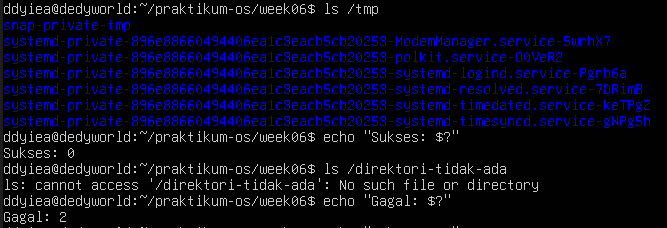

### Pertanyaan Latihan 6.2

1. Jalankan sleep 120 & dan amati kolom STAT pada ps aux. Kondisi apa yang ditampilkan? Mengapa proses sleep berada di kondisi tersebut?
2. Jalanakan beberapa perintah yang berhasil dan yang gagal, lalu catat exit code masing-masing. Pola apa yang apa temukan?

### Jawaban Latihan 6.2

1.  Hasil:
    
    
    Stat SN artinya proses sleep sedang menunggu untuk sesuatu dan memiliki prioritas yang rendah (low priority)

2.  Yang berhasil:
    
    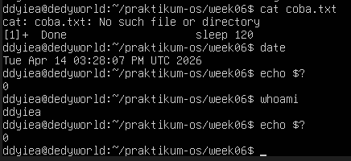
    
    Yang gagal:
    
    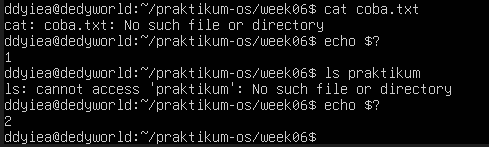
    
    Pola yang ditemukan adalah jika berhasil meng-eksekusi sebuah perintah maka akan muncul kode 0 yang artinya ialah berhasil, sedangkan kode selain 0 berarti gagal. Penjelasannya ialah:
    - 1 = error umum
    - 2 = file/direktori tidak ditemukan
    - 126 = tidak punya permission untuk menjalan perintah
    - 127 = command tidak ditemukan

## Praktikum 6.3 - Mengatur Prioritas Proses

Langkah-langkah:

1. Jalankan proses dengan perintah rendah:

```
nice -n 10 sleep 300 &
```


2. Verifikasi nilai nice pada kolom NI:

```
ps aux | grep sleep
```


3. Ubah nilai nice proses yang sudah berjalan:

```
renice -n 15 -p <PID>
ps -p <PID> -o pid,ni,cmd
```


4. Bersihkan proses percobaan:

```
kill %1
```


### Pertanyaan Latihan 6.3

1. Jalankan nice -n 5 sleep 200 & dan verifikasi nilai NI-nya dengan ps.
2. Ubah nilai nice menjadi 10 menggunakan renice, lalu verifikasi kembali.
3. Coba ubah nilai nice menjadi -5 tanpa sudo. Apa yang terjadi? Mengapa Linux membatasi hal ini untuk user biasa?

### Jawaban Latihan 6.3

1. 

2. 

3. 
   Terajadi error permission denied, hal ini terjadi karena kita bukan super user. Kenapa bisa terjadi? karena jika user biasa bisa memberi prioritas tinggi kepada prosesnya maka bisa mengalahkan nilai prioritas CPU dari proses sistem yang penting dan bisa mengakibatkan sistem lemot hingga crash

## Praktikum 6.4 - Mengirim Sinyal ke Proses

Langkah-langkah:

1. Buat proses percobaan:

```
sleep 500 &
sleep 600 &
sleep 700 &
ps aux | grep -v grep | grep sleep
```


2. Hentikan satu proses dengan SIGTERM dan verifikasi:

```
kill <PID-sleep-500>
ps aux | grep -v grep | grep sleep
```


3. Jeda dan lanjutkan proses dengan SIGSTOP/SIGCONT:

```
kill -SIGSTOP <PID-sleep-600>
ps aux | grep sleep # amati kolom STAT: berubah menjadi T

kill -SIGCONT <PID-sleep-600>
ps aux | grep sleep # STAT kembali ke S
```

- SIGSTOP 
- SIGCONT

4. Hentikan semua proses sleep sekaligus

```
pkill sleep
```


### Pertanyaan Latihan 6.4

1. Jalankan sleep 40 &, kirim SIGSTOP dan amati perubahan kolom STAT. Kondisi apa yang muncul?
2. Kirim SIGCONT dan verifikasi proses kembali berjalan.
3. Hentikan proses dengan sigterm lalu verifikasi sudah tidak ada. Kapan anda memilih SIGKILL daripada SIGTERM?

### Jawaban Latihan 6.4

1. Terjadi perubahan pada kolom stat, yang awalnya SN berubah menjadi TN saat SIGSTOP dikirimkan
   

2. Stat pada proses sleep 400 berubah menjadi SN lagi
   

3. Kita menggunakan SIGKILL jika kita tidak bisa menghentikan proses menggunakan SIGTERM
   

## Praktikum 6.5 - Manajemen Job Foreground dan Background

Langkah-langkah:

1. Jalankan tiga job di background:

```
sleep 200 &
sleep 300 &
sleep 400 &
jobs
```


2. Bawa job pertama ke foreground, jeda, lalu kembalikan ke background:

```
fg %1
# Tekan Ctrl+Z untuk menjeda
bg %1
jobs
```


3. Hentikan semua job:

```
kill %1 %2 %3
jobs
```


### Pertanyaan Latihan 6.5

1. Jalankan top di foreground. Apa yang terjadi di terminal?
2. Tekan Ctrl+Z dan cek statusnya dengan jobs. Kondisi apa yang ditampilkan?
3. Pindahkan ke background dengan bg. Apakah top dapat berjalan dengan baik di background? Mengapa?
4. Kembalikan ke foreground dengan fg, lalu keluar dengan q.

### Jawaban Latihan 6.5

1. Tampilan terminal akan berganti menjadi tampilan top
   

2. Status top menjadi suspended
   

3. top akan kembali berstatus suspended, ini dikarenakan top membutuhkan terminal untuk menampilkan ui-nya, sehingga akan terjeda apabila ia berjalan di background
   

4. 

## Praktikum 6.6 - Pemantauan Proses

Langkah-langkah:

1. Temukan proses dengan penggunaan CPU dan memori tertinggi:

```
ps aux --sort=-%cpu | head -10
ps aux --sort=-%mem | head -10
```


2. Jalankan top dan eksplorasi shortcutnya:

```
top
# Tekan M, P, l, u secara bergantian
# Tekan q untuk keluar
```


3. Install dan jalankan htop:

```
sudo apt install -y htop
htop
# Tekan F6 untuk pilih kolom pengurutan
# Tekan F10 atau q untuk keluar
```


### Pertanyaan Latihan 6.6

1. Gunakan ps aux -sort=%mem untuk menemukan proses yang menggunakan memori paling banyak di VM anda. Proses apa itu?
2. Di dalam top, tekan 1. Apa yang berubah pada tampilan? Mengapa informasi ini berguna?
3. Di dalam htop, navigasikan ke proses sshd menggunakan tombol panah. Tekan f9 dan amati opsi sinyal yang tersedia.

### Jawaban Latihan 6.6

1. Proses yang memakan memori paling banyak adalah fwupd (Firmware Update Daemon)
   

2. Yang berubah ialah tampilan cpu nya, ini berguna untuk melihat penggunaan cpu dan membantu diagnosa bottleneck
   

3. Terdapat banyak opsi sinyal yang tersedia
   

## 1.8 Latihan

### Pertanyaan 6.A

Eksplorasi Proses Sistem 1. Jalankan ps aux -forest dan temukan proses dengan PID 1. Apa nama dan fungsi proses tersebut dalam sistem Linux modern? 2. Hitung berapa proses yang dimiliki oleh user root dan berapa yang dimiliki oleh user anda. Mengapa root memiliki lebih banyak proses? 3. Temukan semua proses yang berada dalam kondisi S. Mengapa sebagaian besar proses di sistem berada dalam kondisi ini?

### Pertanyaan 6.B

Simulasi Manajemen Job 1. Jalankan tiga perintah sleep dengan durasi 100, 200, dan 300 detik di background. Verifikasi ketiganya dengan jobs 2. Bawa job kedua ke foreground, jeda dengan Ctrl+Z, lalu kembalikan ke background dengan bg 3. Hentikan job pertama kill %1. Tampillkan kembali daftar job. Berapa job yang tersisa?

### Pertanyaan 6.C

Prioritas dan Sinyal 1. Jalankan dua proses sleep: satu dengan nice +5 dan satu dengan nice +15. Verifikasi nilai NI keduanya dengan ps. 2. Gunakan renice untuk mengubah nice proses pertama menjadi +10. Proses mana yang kini lebih diprioritaskan scheduler? 3. Kirim SIGSTOP ke salah satu proses, verifikasi kembali T-nya, lalu kirim SIGCONT. Akhiri semua proses percobaan dengan pkill sleep.

### Jawaban 6.A

1.  
    Proses ini adalah proses pertama yang dijalankan kernel setelah booting dan jadi induk dari semua proses lainnya. Tugasnya:
    - Menghidupkan semua service saat boot
    - Manage depedency antar service
    - Jika ada proses yang parent-nya mati, maka systemd akan "mengadopsi"

2.  - root: 
    - laut: 

3.  
    Proses ini memiliki status S karena mereka menunggu sesuatu terjadi baru mereka aktif

### Jawaban 6.B

1. 

2. 

3. 

### Jawaban 6.C

1. 

2. Proses yang didahulukan adalah sleep 700 daripaad sleep 800
   

3. 
